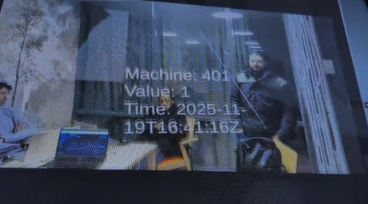

### sprint 1: Planning, Setup and First Node‑RED Steps  
**Mon 27 Oct – Fri 31 Oct 2025**

This week was about shaping the project and getting the technical ground ready. I co‑planned the overall pipeline on the whiteboard, sketching how PLC data would flow through Node‑RED and InfluxDB into Unity with MRTK3 and WebRequests driving the XR side. I helped Laheeq with the initial Node‑RED environment, especially around testing OPC UA connections and understanding how we might read SIF‑401 data even while wireless access was still unstable.

While the backend team experimented with live reads, I focused on turning our notes into a clearer plan: which parts belonged to PLC/Node‑RED, which to data storage, and what Unity would eventually need from them. This early planning made it easier later to argue for features like alarm‑driven UI tiles and loader animations because we already had them in the first diagrams.

## Sprint 2 – Wireless Access and Data Path

### Establishing wireless connection to Machine 401

In this sprint my main contribution was getting reliable wireless access to Machine 401 so the rest of the team could develop Node‑RED flows without constantly fighting the network. I analysed how the WLAN_SIF400 network behaved, documented that it had no direct internet, and worked out the steps for connecting laptops to the cell while still being able to reach Node‑RED running locally.

Once the connection procedure was clear, I wrote it down for the team and walked others through it so they could reproduce the setup quickly. This freed Laheeq and the backend group to focus on OPC UA variables and HTTP endpoints, while I kept an eye on how this data path would later feed into InfluxDB and Unity.

## Sprint 3 – Unity Data Link, UI and Animation Experiments

In Sprint 3 my work shifted fully to the Unity side. The first priority was proving that our pipeline actually reached XR, so I helped establish the Unity–Node‑RED link and confirm that live values could be shown on HoloLens before going deeper into animations. The screenshot below documents this milestone, where a simple Unity scene successfully displayed data coming from our backend.

Once the data path was working, I focused on the Unity tasks from the Taiga board: designing the UI, creating placeholder animations for alarms, loading 3D objects, and preparing Unity to display mitigation steps. I set up the main scene with MRTK3, organised the hierarchy, and imported simple loader structures that stood in for the real SIF‑401 equipment. Using these placeholders I began blocking out how alarms would appear in XR and where mitigation information would sit around the user.

I also experimented with different motion ideas for loaders and error reactions. The videos below capture early tests of pallet and cylinder movement, timing experiments, and rough alarm responses. These clips were important for deciding which motions felt readable and believable enough to refine in later sprints.

### Media from this sprint

<video src="/animationideastest.mp4" controls width="640">
  Your browser does not support the video tag.
</video>

<video src="/motionanimator.mp4" controls width="640">
  Your browser does not support the video tag.
</video>

<video src="/placeholders.mp4" controls width="640">
  Your browser does not support the video tag.
</video>

