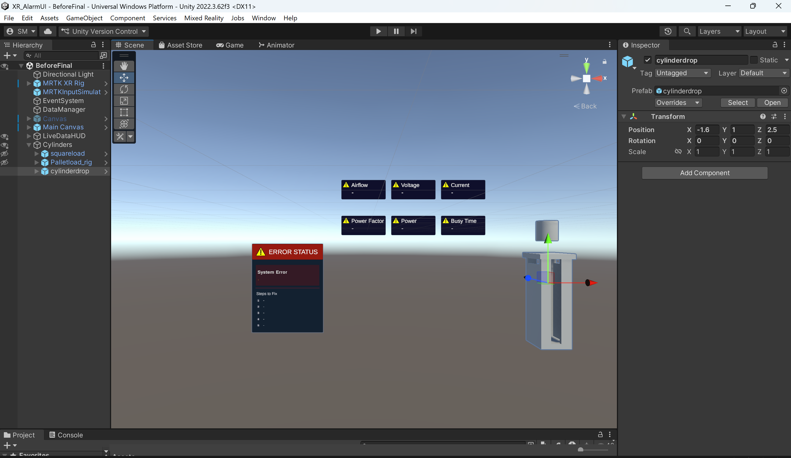
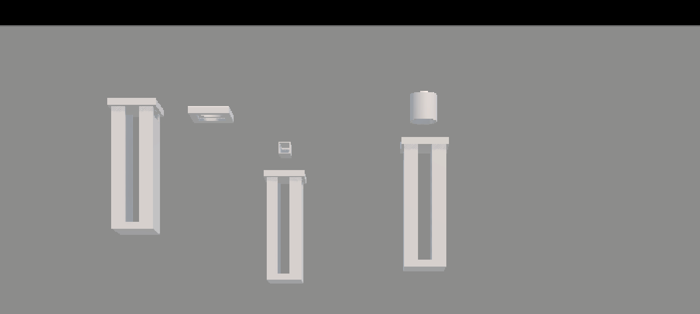

# XR Individual Project Portfolio 2

**Author:** Sahil Mujahid  
**Course:** Industrial Project with XR  
**Date:** January 2026  

This portfolio presents my individual contribution, learning journey, and reflections for an XR project that visualises live machine alarms and mitigation steps in Unity and HoloLens.

## Welcome

I worked as the project designer, pipeline architect, animator, and Unity XR contributor for our six‑person team.  
My main focus was turning the idea of “live error mitigation in XR” into a concrete pipeline from PLC data, through Node‑RED and InfluxDB, into an interactive Unity scene.

## Portfolio sections

Below, you can jump directly to each part of the portfolio:

### 1. Contributions

A detailed breakdown of my responsibilities across all five sprints, including:

- Proposing and mapping the OPC UA/SMC API → Node‑RED → InfluxDB → Unity pipeline  
- Coordinating Node‑RED variable selection and JSON format for alarms  
- Working on Unity WebRequests, alarm‑driven UI tiles, and loader animations  

[View my contributions →](contributions.html)

---

### 2. Reflection

Personal reflections on what went well, what was hard, and which skills I developed, such as:

- Balancing an architect/integration role with hands‑on Unity work  
- Communicating across backend and XR teams  
- Planning animations and UI that match real industrial behaviour  

[Read my reflection →](reflection.html)

---

### 3. Peer feedback

Once collected, this section will summarise comments from teammates and how I responded to them, for example:

- Clarity of the pipeline description and responsibilities  
- Usefulness of screenshots and diagrams  
- Accuracy of alarm and animation mapping explanations  

[Go to peer feedback →](peer-feedback.html)

---

### 4. Ethics & impact

Discussion of the benefits, risks, and ethical considerations of using XR for industrial monitoring, looking at:

- Operator safety, comfort, and trust in the visualisation  
- Data quality, privacy, and possible misuse for surveillance  
- How our design choices try to support responsible use of XR  

[Explore ethics and impact →](ethics.html)

---

## Visual snapshot

Here are two quick images from the project:

These screenshots highlight the XR error status panel and the loader rigs that are driven by live alarm data in the final system.

